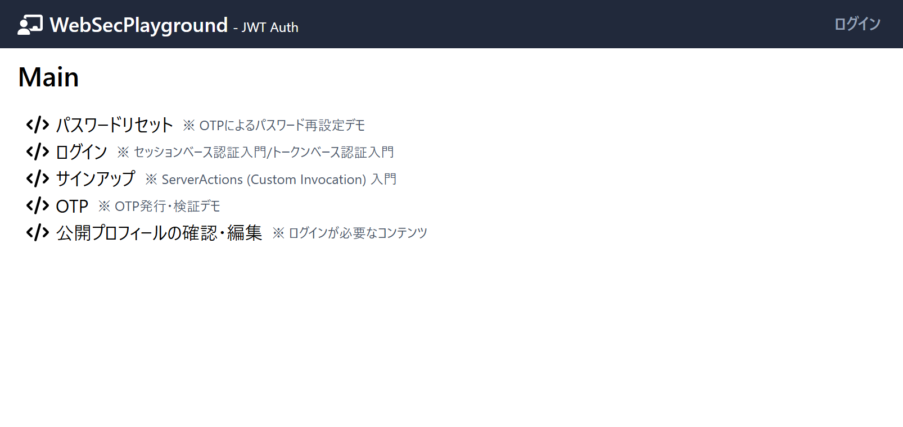
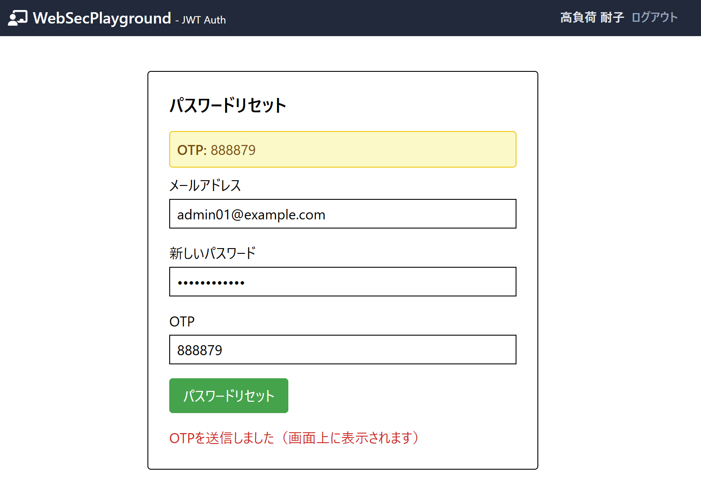
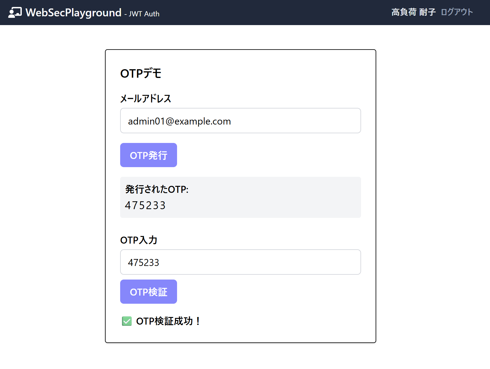

## ⚠️ 注意事項

このプロジェクトは**Webアプリのセキュリティ学習・検証用のサンプル**です。
安全な開発・運用のための実験や検証を目的としています。

- 公開サーバーやインターネット上でのホストは推奨しません。
- ローカル環境（localhost）でのみ実行してください。
- 本番用途や重要なデータの取り扱いには使用しないでください。

※ 本リポジトリは参考教材や学習用サンプルを元に独自にカスタマイズしたものです。

## セットアップ手順

### 1. リポジトリのクローン

```
git clone https://github.com/Kyushokugorira/web-sec-playground.git
cd web-sec-playground
```

※ クローン先のディレクトリ名は任意で変更できます。

### 2. 依存関係のインストール

```bash
npm i
```

### 3. 環境変数の設定ファイル (.env) の作成

プロジェクトのルートフォルダに `.env` (環境変数の設定ファイル) を新規作成して以下の内容を記述してください。

```
DATABASE_URL="file:./app.db"
JWT_SECRET=ABCDEFG123456789UVWXYZ
```

- `JWT_SECRET` は認証処理に必要な秘密キーです。安全性を確保するため、適当なランダムな英数字を用いた **16文字以上の文字列** に置き換えてください。文字数が不十分だと、動作時にエラーとなる可能性があります。


### 4. データベースの初期化

```bash
npx prisma db push
npx prisma generate
npx prisma db seed
```


### 5. 開発サーバの起動

```bash
npm run dev
```

### 6. ビルドと実行

```bash
npm run build
npm run start
```

### 7. データベースの状態確認

```bash
npx prisma studio
```

---


## 画面イメージ

### トップページ


### パスワードリセット画面


### OTPデモ画面


---

## 利用方法・主な機能


- トップページ（`/`）から各機能ページへアクセスできます。
	- ログイン、サインアップ、公開プロフィール編集、OTPデモ、**パスワードリセット**
- **パスワードリセット**（`/reset-password`）
	- メールアドレスを入力しOTPを発行、画面上に表示されたOTPと新しいパスワードを入力することでパスワードを再設定できます。
	- メール送信は行わず、OTPは画面上にのみ表示されます。
- **OTPデモ**（`/otp-demo`）
	- 画面上でOTP（ワンタイムパスワード）の発行・検証を体験できます。
	- メール送信は行わず、発行されたOTPが画面に表示されます。


## セキュリティ対策・創意工夫

- **パスワードはbcryptでハッシュ化して保存**
- **Cookieには HttpOnly, Secure, SameSite=Strict 属性を付与**（セッションや認証用途で利用する場合）
- **全ページにCSP（Content-Security-Policy）を厳格に設定**
- **入力値はDOMPurifyでサニタイズ**
- **JWTはlocalStorageで管理し、XSSリスクを低減**
- **パスワード強度をリアルタイムで判定し、弱いパスワードを防止**
- **不要な認証方式や「ニュース」「ショップ」等の機能・型・APIは全て削除済み**

---

## パスワードリセットの流れ

1. 「パスワードリセット」画面でメールアドレスを入力し、OTPを発行
2. 画面上に表示されたOTPを控える
3. 新しいパスワードとOTPを入力して送信
4. パスワードがリセットされ、ログイン可能に

※ 本番運用ではOTPはメール送信が必須ですが、本アプリでは画面表示のみです


- **OTPデモ機能の追加**
	- `/otp-demo` でOTP発行・検証の流れを画面上で確認できます。
- **パスワードリセット機能の追加**
	- `/reset-password` でOTPによるパスワード再設定が可能になりました。
- **CSP（Content-Security-Policy）等のセキュリティヘッダーをmiddlewareで一括付与**
	- XSS対策としてCSPを厳格化
- **サニタイズ用ユーティリティの追加**
	- `src/app/_utils/sanitize.ts` でDOMPurifyによるサニタイズ関数を提供
- **JWTはJSONレスポンスで返却し、localStorage等で管理する方式**
	- Cookieはサーバーから発行せず、XSS対策を重視した設計
- **パスワード強度判定UIの改善**
	- 入力に応じてリアルタイムで強度表示

## 補足

- **パスワードリセットやOTPの仕組みは学習用のため、実際の運用ではメール送信やより厳格なセキュリティ対策が必要です。**
- **ユーザー登録やパスワードリセットの際、画面上にOTPやパスワードが表示される仕様は本番環境では絶対に避けてください。**

---

